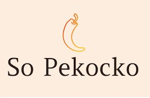

# Construire une API sécurisée pour une application d'avis gastronomiques 

## So Pekocko

***

### 🛠️ &nbsp; Installation

#### &nbsp; 🖥️ Frontend
* Cloner le dépôt suivant [GitHub](https://github.com/OpenClassrooms-Student-Center/dwj-projet6)
* Exécuter `npm install`
* Installer Nodejs version 14.15.1, privilégier la version LTS
* Exécuter `npm install node-sass@4.14.1`
* Le projet a été généré avec  [Angular CLI](https://github.com/angular/angular-cli) version 6.0.8.
* Démarrer `ng serve` (ou `npm start`) pour avoir accès au serveur de développement.
* Rendez-vous sur `http://localhost:4200`.

#### &nbsp; 🔨 backend
* Cloner ce dépôt GitHub
* Exécuter `npm install`
* Lancez le serveur avec `nodemon server`.

#### &nbsp; 📚 Connection à la base de donnée
* <ins>1er méthode</ins> : Retrouver le fichier nommé `.env_example` et supprimer la partie `_exemple` afin d'obtenir un fichier nommé `.env`
* <ins>2eme méthode</ins> : Si vous possédez un compte mongoDB, répétez l'opération précédente en remplaçant également `So_Pekocko_User` par votre identifiant et votre mot de passe. 
